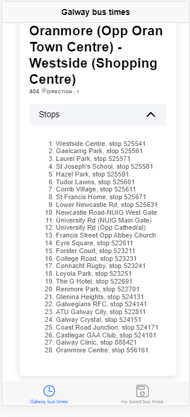
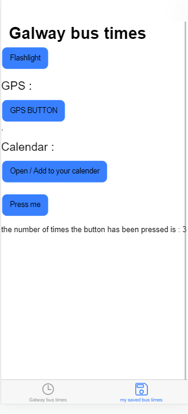

# WIKI FOR REPO

 

# Galway Bus times app 

This is my repeat project for my college course module - Mobile applications development
This app pulls down JSON data from a public api ( https://galway-bus.apis.ie/ ) and parses that data to display both each bus journey and each stop by that journey. It is meant to be a real world useful application. On the second page the app always utilizes cordova plugins to offer a torch-toggle functionality aswell as a gps location displayer and (uniquely to my project compared to my fellow college mates) a calender register functionality)

## WIKI / HOW TO START APPLICATION

### Install NPM
* npm install
* 

##This application reads an api to display bus times in Galway city

 

## 🔧 Technologies & Tools:

